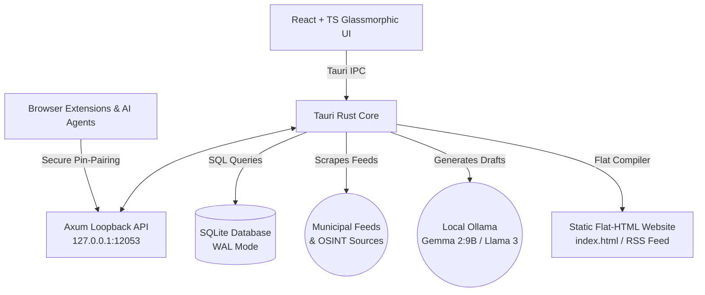

# 🏛️ CivicNews

> **A local-first, zero-runtime civic intelligence tool for single-editor community newsrooms.**

CivicNews empowers citizen journalists, local editors, and community observers to monitor municipal government feeds, extract key OSINT signals, draft objective reports using local LLMs, verify facts with linked primary record citations, and publish flat HTML sites—all running 100% locally on your computer with **zero external cloud runtime dependencies** and **no technical installation hurdles** for readers.

---

## 🌟 Key Features

* **Local-First Architecture**: Built on Tauri v2, React, and SQLite. Your sources, records, leads, and drafts never leave your device.
* **OSINT Detector Engine**: Automated background parser that scans primary record documents for:
  * 💰 Large budgets or contracts exceeding customizable thresholds.
  * 🗳️ Official council votes, adopted resolutions, and decisions.
  * 👥 Personnel transitions (appointments, resignations, hires).
  * 📅 Public meetings scheduled and deadlines.
  * 🔍 Custom keyword watchlists.
* **Factual Guardrail Inspector**: An automated editor that scans drafts before publication to:
  * Ensure full citation coverage (claims mapped directly to raw evidence IDs).
  * Prevent accusatory terminology that lacks linked documentary proof.
  * Enforce standard presumption-of-innocence modifiers (e.g., "alleged").
* **Flat HTML Compiler & Wizard**: Compiles your approved story queue into a clean, modern, responsive static site with built-in RSS feeds. Features a guided drag-and-drop wizard for easy hosting on GitHub Pages, Netlify, or Vercel.
* **Social Media Promo Pack Generator**: Automatically synthesizes your verified drafts into optimized posts for Twitter/X, Facebook, and Reddit.
* **Multi-Client Bridges**:
  * **Tauri Desktop Client**: The central command deck (Queue, Workbench, System status).
  * **Browser Extensions (Chromium/Safari)**: One-click extraction of public record PDFs or pages right from municipal portals. Includes a simple drag-and-drop installer.
  * **Coding Agent Skills**: Integrates seamlessly with AI editors like Codex, Cowork, or Antigravity.

---

## 🗺️ System Architecture

CivicNews runs entirely on the user's local machine, establishing a sandboxed Axum loopback server to coordinate browser extensions and agent clients securely.



For a detailed breakdown of security tokens, CORS policies, DNS rebinding guards, and database schemas, check out the [Architecture Documentation](file:///C:/Users/scott/Documents/antigravity/eager-archimedes/docs/architecture.md).

---

## 📦 Project Structure

```text
├── src/                      # React Frontend Dashboard UI
│   ├── components/           # UI Elements (Workbench, Queue, Onboarding Wizard)
│   └── App.tsx               # Main Dashboard application entry point
├── src-tauri/                # Tauri Rust Backend Core
│   ├── migrations/           # Database schema migrations
│   ├── templates/            # Flat HTML website templates (index, post, CSS)
│   └── src/
│       ├── core/             # Rust Core Library
│       │   ├── auth.rs       # Pin-pairing and DNS rebinding authorization middleware
│       │   ├── backups.rs    # Atomic database backup and restore logic
│       │   ├── compiler.rs   # Static flat-HTML compilation engine
│       │   ├── db.rs         # SQLite schema & CRUD operations
│       │   ├── detectors.rs  # OSINT pattern matching regex logic
│       │   ├── guardrails.rs # Pre-publication syntax & citation checker
│       │   ├── llm.rs        # Local Ollama client & model pulling wrappers
│       │   ├── scraper.rs    # Feed parser and webpage text cleaner
│       │   └── server.rs     # Axum loopback HTTP controller handlers
│       └── tauri_cmds.rs     # Tauri IPC command bridges
├── browser-extension/        # Pairable Browser Extensions
│   ├── chromium/             # Google Chrome / Edge Manifest v3 Extension
│   └── safari/               # Xcode Safari Web Extension scaffolding
└── assistant-skill/          # Codex / Cowork / Antigravity Assistant Plugin
```

---

## 🚀 Getting Started (Developers)

### Prerequisites

1. **Rust & Cargo**: Follow instructions at [rustup.rs](https://rustup.rs/).
2. **Node.js & npm**: Install via [nodejs.org](https://nodejs.org/).
3. **Ollama**: Download and install from [ollama.com](https://ollama.com/).

### Installation

1. Clone the repository:
   ```bash
   git clone https://github.com/scottconverse/CivicNewspaper.git
   cd CivicNewspaper
   ```

2. Install dependencies:
   ```bash
   npm install
   ```

3. Run the development server:
   ```bash
   npm run tauri dev
   ```

4. Build production installers (macOS `.app`, Windows `.msi`):
   ```bash
   npm run tauri build
   ```

---

## 📖 Further Documentation

* 📕 **[User Manual for Non-Technical Editors](file:///C:/Users/scott/Documents/antigravity/eager-archimedes/docs/user_manual.md)**: A step-by-step guide explaining setup, Ollama configuration, feed management, and publishing.
* 📐 **[System & Security Architecture](file:///C:/Users/scott/Documents/antigravity/eager-archimedes/docs/architecture.md)**: Deep dive into API endpoints, database structures, pairing flows, and security protocols.
* 💬 **[Seed Discussion Posts](file:///C:/Users/scott/Documents/antigravity/eager-archimedes/docs/discussion_seeds.md)**: Templates for repository Discussions (Welcome post, local LLM FAQ, editorial standards guide).

---

## 📜 License

This project is licensed under the MIT License - see the LICENSE file for details.
