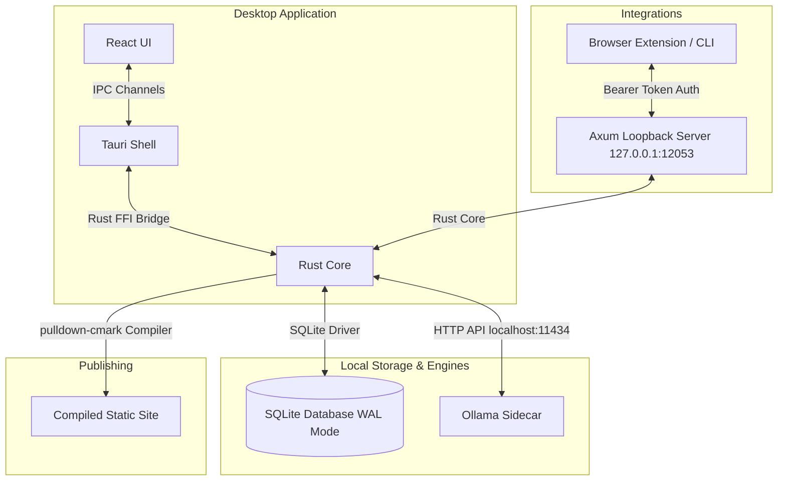
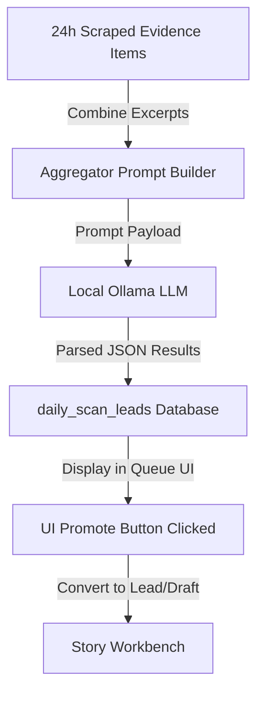
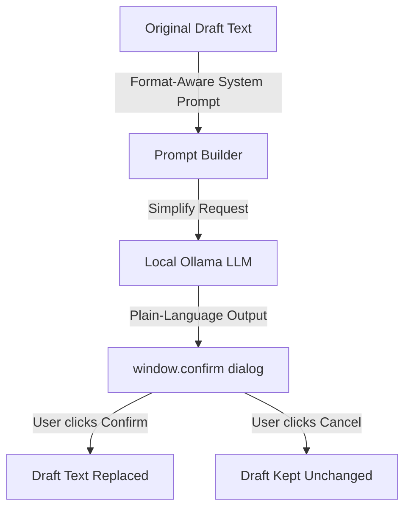
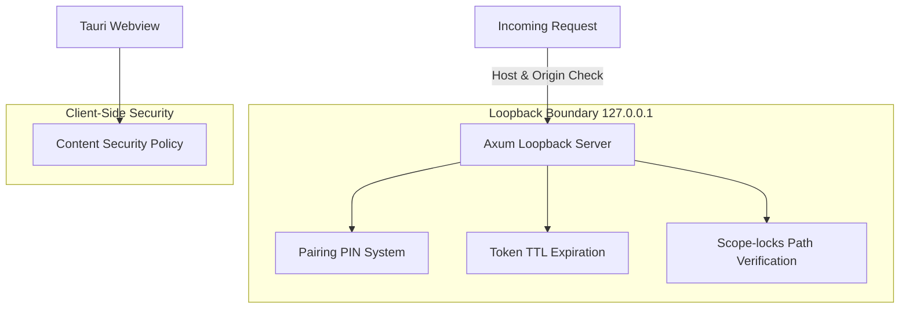
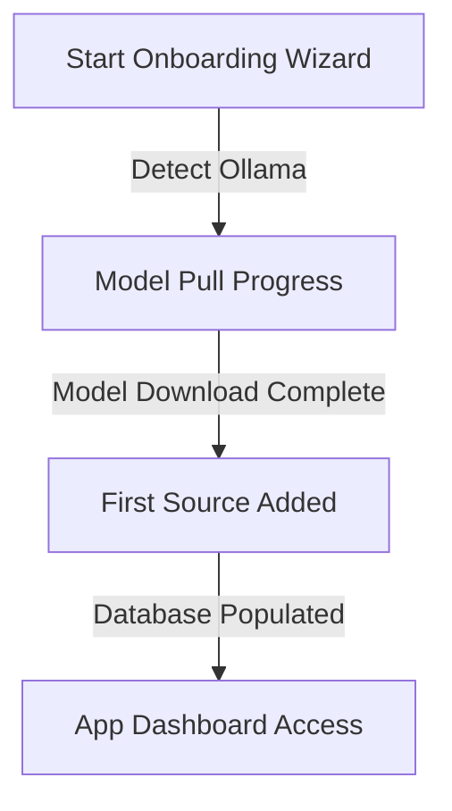

# CivicNewspaper System Architecture

This document describes the architectural design, data models, and security boundaries of CivicNewspaper.

---

## 🏗️ System Overview

CivicNewspaper is a local-first desktop application. It operates entirely on the user's local machine, leveraging Tauri for the OS interface, React for the UI, and a Rust core for data orchestration.

### Components
1. **Tauri Desktop Shell**: Native desktop host wrapper compiled with Rust. Manages window lifecycles, native file dialogs, and subprocess security.
2. **React UI**: Responsive user interface built with React 19, TypeScript, and modern CSS.
3. **Rust Core**: Hand-written core modules implementing feed scraping, database persistence, regex matching, markdown compilation, and local server routing.
4. **Ollama Sidecar**: Independent service running locally on port `11434` providing offline LLM completion APIs.
5. **SQLite Database**: Single-file relational storage with Write-Ahead Logging (WAL) enabled for performance and crash resilience.
6. **Compiled Static Site**: Output folder containing parsed HTML files, style assets, and RSS feeds.

---

## 🔄 Data Flow

The core workflow of CivicNewspaper translates municipal records into structured news feeds.

```mermaid
graph LR
    Sources[Sources] -->|URLs/Feeds| Scraper[Scraper]
    Scraper -->|Excerpts / Raw Text| Detectors[Regex Detectors]
    Detectors -->|Matches & Checklist| Leads[Leads]
    Leads -->|Promote / AI Draft| Drafts[Drafts]
    Drafts -->|pulldown-cmark Compiler| CompiledSite[Compiled Site]
    CompiledSite -->|Output| RSS[RSS Feed]
```

1. **Sources**: RSS feeds, HTML portals, or browser clips.
2. **Scraper**: Pulls raw HTML or XML content, extracts clean text, and stores them as `evidence_items`.
3. **Detectors**: Scans stored text chunks against regex rules (e.g. monetary thresholds, key votes, personnel updates).
4. **Leads**: Structured signals that group matched evidence paragraphs.
5. **Drafts**: Factual markdown articles written on the Workbench tab.
6. **Compiled Site & RSS**: Finished static HTML documents and RSS feeds exported to the output directory.

---

## ⚡ Daily Scan Flow

The Daily Scan uses the local language model to aggregate multiple sources of information over a 24-hour window and identify potential leads.

* **Evidence Items**: Scraped documents and text chunks collected in the last 24 hours.
* **Aggregator Prompt**: Groups all excerpts into a single compact context window, requesting the LLM to identify key developments.
* **Local LLM**: Generates structured, tokenized JSON summaries of findings.
* **daily_scan_leads**: Database representation of scan findings.
* **UI Promote**: Operator reviews scan results and clicks "Promote" to establish an editable story draft.

---

## ✍️ Plain-Language Rewrite Flow

Operators can simplify complex legalese and municipal jargon into plain English using the offline rewrite flow.

* **Format-Aware System Prompt**: Instructs the LLM to write for a general public audience, preserving numbers and names while discarding jargon.
* **window.confirm**: Displays a side-by-side modal panel for user verification.
* **Draft Replaced / Draft Kept**: The editor content is updated only upon explicit human confirmation.

---

## 🔒 Security Model

To protect the local computer from malicious web scripts, CivicNewspaper enforces rigid security boundaries.

* **Loopback Server**: The Axum server strictly binds to the loopback IP `127.0.0.1:12053`. Any external interface requests are rejected.
* **Host & Origin Headers**: Checks the `Host` and `Origin` headers on incoming calls to block DNS rebinding and cross-origin attacks from malicious browser tabs.
* **Pairing PIN**: A temporary 6-digit PIN with a short TTL (5 minutes) is generated to securely exchange long-term cryptographically strong bearer tokens with paired extensions.
* **Scope-locks**: File system directories are verified prior to writing backups or compiled sites, preventing directory traversal attacks.
* **Content Security Policy**: Webview header restriction blocks loading third-party scripts or frames.

---

## 🚀 Onboarding Flow

The startup wizard ensures all dependencies are set up before allowing the operator to use the application workspace.

* **Detect Ollama**: Checks if the Ollama background daemon is reachable on `127.0.0.1:11434`.
* **Model Pull Progress**: Triggers the recommended model pull and tracks the download progress bytes.
* **First Source**: Requests the user's initial feed to populate the workspace database.

---

## 🗃️ Database Schema

The SQLite schema consists of 7 tables defined in `0001_init.sql` and run atomically using a migration runner:

### `sources`
Stores details of the public municipal feeds to monitor.
* `id`: `INTEGER PRIMARY KEY AUTOINCREMENT`
* `name`: `TEXT NOT NULL`
* `url`: `TEXT NOT NULL UNIQUE`
* `type`: `TEXT NOT NULL` (e.g., `primary_record`, `official_comm`, `community_signal`, `media_lead`)
* `status`: `TEXT NOT NULL DEFAULT 'online'`
* `last_success_at`, `last_failed_at`, `last_scraped`: `TEXT` (RFC3339 timestamps)

### `evidence_items`
Raw data chunks extracted from municipal documents.
* `id`: `INTEGER PRIMARY KEY AUTOINCREMENT`
* `source_id`: `INTEGER REFERENCES sources(id) ON DELETE CASCADE`
* `url`: `TEXT` (source file URL link)
* `fetched_at`: `TEXT NOT NULL`
* `excerpt`: `TEXT NOT NULL` (the raw text chunk)
* `content_hash`: `TEXT NOT NULL UNIQUE` (Sha256 hash of the excerpt to prevent duplicates)
* `entities`: `TEXT NOT NULL DEFAULT '[]'` (JSON array of parsed OSINT entities)

### `leads`
Flags raised by automated detector matching.
* `id`: `INTEGER PRIMARY KEY AUTOINCREMENT`
* `detector_name`: `TEXT NOT NULL` (e.g., `Money Threshold`, `Watchlist Hit`)
* `why`: `TEXT NOT NULL` (human-readable explanation)
* `confidence`: `TEXT NOT NULL` (e.g., `low`, `med`, `high`)
* `risk_level`: `TEXT NOT NULL DEFAULT 'low'`
* `confirmation_checklist`: `TEXT NOT NULL DEFAULT '[]'` (JSON array of verifications)
* `created_at`: `TEXT NOT NULL`

### `lead_evidence`
Many-to-many relationship mapping evidence items to leads.
* `lead_id`: `INTEGER REFERENCES leads(id) ON DELETE CASCADE`
* `evidence_id`: `INTEGER REFERENCES evidence_items(id) ON DELETE CASCADE`
* `PRIMARY KEY (lead_id, evidence_id)`

### `drafts`
Article documents in various states of verification.
* `id`: `INTEGER PRIMARY KEY AUTOINCREMENT`
* `lead_id`: `INTEGER REFERENCES leads(id) ON DELETE SET NULL`
* `format`: `TEXT NOT NULL` (e.g., `brief`, `watch`, `explainer`, `investigation`, `opinion`)
* `title`: `TEXT NOT NULL`
* `content`: `TEXT NOT NULL` (Markdown body)
* `status`: `TEXT NOT NULL DEFAULT 'lead'` (statuses include `lead`, `draft_generated`, `ready_to_review`, `ready_to_publish`, `hold`, `killed`, `corrected`)
* `verification_checklist`: `TEXT NOT NULL DEFAULT '[]'`
* `missing_evidence_notes`, `correction_note`: `TEXT`
* `created_at`, `updated_at`: `TEXT NOT NULL`

### `published_posts`
Records of compiled publications.
* `id`: `INTEGER PRIMARY KEY AUTOINCREMENT`
* `draft_id`: `INTEGER REFERENCES drafts(id) ON DELETE CASCADE`
* `file_path`: `TEXT NOT NULL`
* `url`: `TEXT NOT NULL`
* `published_at`: `TEXT NOT NULL`
* `correction_history`: `TEXT NOT NULL DEFAULT '[]'`

### `paired_clients`
Authorized external integrations.
* `id`: `INTEGER PRIMARY KEY AUTOINCREMENT`
* `token`: `TEXT NOT NULL UNIQUE`
* `label`: `TEXT NOT NULL`
* `pairing_pin`: `TEXT`
* `pin_expires_at`: `TEXT`
* `created_at`: `TEXT NOT NULL`
* `last_used_at`: `TEXT`
* `revoked`: `INTEGER NOT NULL DEFAULT 0` (0=false, 1=true)
