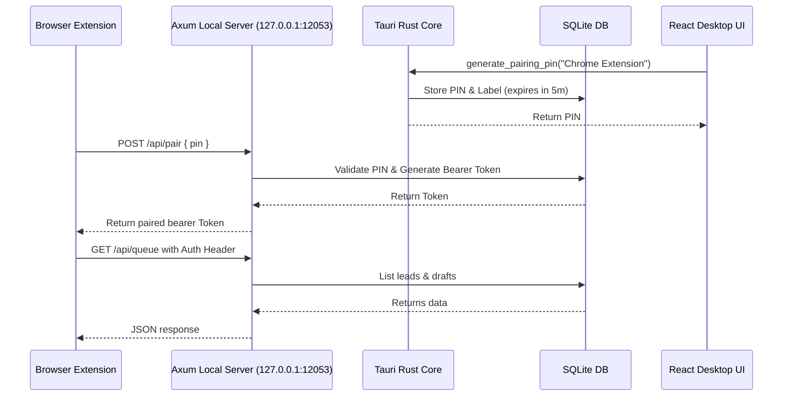

# CivicNews System Architecture
## *Technical Design and Security Protocol Specification*

This document outlines the architectural specifications, security protocols, database schemas, and integration flows of the CivicNews local core.

---

## 🏗️ System Components

CivicNews utilizes a hybrid desktop-server layout to allow secure coordination between the desktop interface, browser extensions, and developer plugins without requiring cloud infrastructure.

### 1. Tauri v2 Desktop Wrapper
* Manages the OS window, native system tray, and alerts.
* Provides native system commands (`tauri_cmds.rs`) bridged to the React frontend UI.
* Exposes file selection dialogs for secure database backup and restore operations.

### 2. Axum Local Loopback Server (`127.0.0.1:12053`)
* Runs inside a background `tokio` thread spawned during Tauri initialization.
* Exposes HTTP endpoints allowing browser extensions and IDE skills to pair and interact with the database.
* strictly binds to the loopback interface (`127.0.0.1`) to prevent external network access.

### 3. SQLite Database (`civicnews.db`)
* Runs in **WAL (Write-Ahead Log) mode** to enable concurrent reads and writes.
* Handled safely via thread-safe `Arc<Mutex<Connection>>` guards.

---

## 🔒 Security Protocols & Protections

To protect the local system from malicious web scripts running inside user browsers, multiple levels of defense-in-depth are implemented in `auth.rs`:

### 1. Host Header Validation
To defend against **DNS Rebinding Attacks** (where a malicious website overrides local DNS resolution to route requests to local loopback ports), the Axum middleware verifies the `Host` header of every incoming HTTP request:
* Allowed Hosts: `127.0.0.1:12053` or `localhost:12053` (case-insensitive).
* Any other host immediately returns a `400 Bad Request` status.

### 2. Origin Whitelisting (CORS)
To prevent cross-site request forgery (CSRF) from arbitrary browser tabs:
* The `Origin` header is checked on all requests containing it.
* Only trusted origins (`chrome-extension://...`) or absent origins (for CLI/IDE tools) are permitted.
* Untrusted origins return `403 Forbidden`.

### 3. Token Pairing & Authorization
* Pairing requires a short-lived (5-minute expiration) 22-char token generated by the Tauri client.
* Upon validation (`POST /api/pair`), a cryptographically secure token is returned to the client.
* Subsequent API requests must attach this token as a `Bearer` token inside the `Authorization` header.
* Revoking a client from the Settings tab immediately invalidates its token in the database.

---

## 🗃️ Database Schema

The SQLite schema consists of 7 tables defined in `0001_init.sql` and run atomically using a migration runner:

### `sources`
Stores details of the public municipal feeds to monitor.
* `id`: `INTEGER PRIMARY KEY AUTOINCREMENT`
* `name`: `TEXT NOT NULL`
* `url`: `TEXT NOT NULL UNIQUE`
* `type`: `TEXT NOT NULL` (e.g., `primary_record`, `official_comm`, `community_signal`, `media_lead`)
* `status`: `TEXT NOT NULL DEFAULT 'online'`
* `last_success_at`, `last_failed_at`, `last_scraped`: `TEXT` (RFC3339 timestamps)

### `evidence_items`
Raw data chunks extracted from municipal documents.
* `id`: `INTEGER PRIMARY KEY AUTOINCREMENT`
* `source_id`: `INTEGER REFERENCES sources(id) ON DELETE CASCADE`
* `url`: `TEXT` (source file URL link)
* `fetched_at`: `TEXT NOT NULL`
* `excerpt`: `TEXT NOT NULL` (the raw text chunk)
* `content_hash`: `TEXT NOT NULL UNIQUE` (Sha256 hash of the excerpt to prevent duplicates)
* `entities`: `TEXT NOT NULL DEFAULT '[]'` (JSON array of parsed OSINT entities)

### `leads`
Flags raised by automated detector matching.
* `id`: `INTEGER PRIMARY KEY AUTOINCREMENT`
* `detector_name`: `TEXT NOT NULL` (e.g., `Money Threshold`, `Watchlist Hit`)
* `why`: `TEXT NOT NULL` (human-readable explanation)
* `confidence`: `TEXT NOT NULL` (e.g., `low`, `med`, `high`)
* `risk_level`: `TEXT NOT NULL DEFAULT 'low'`
* `confirmation_checklist`: `TEXT NOT NULL DEFAULT '[]'` (JSON array of verifications)
* `created_at`: `TEXT NOT NULL`

### `lead_evidence`
Many-to-many relationship mapping evidence items to leads.
* `lead_id`: `INTEGER REFERENCES leads(id) ON DELETE CASCADE`
* `evidence_id`: `INTEGER REFERENCES evidence_items(id) ON DELETE CASCADE`
* `PRIMARY KEY (lead_id, evidence_id)`

### `drafts`
Article documents in various states of verification.
* `id`: `INTEGER PRIMARY KEY AUTOINCREMENT`
* `lead_id`: `INTEGER REFERENCES leads(id) ON DELETE SET NULL`
* `format`: `TEXT NOT NULL` (e.g., `brief`, `watch`, `explainer`, `investigation`, `opinion`)
* `title`: `TEXT NOT NULL`
* `content`: `TEXT NOT NULL` (Markdown body)
* `status`: `TEXT NOT NULL DEFAULT 'lead'`
* `verification_checklist`: `TEXT NOT NULL DEFAULT '[]'`
* `missing_evidence_notes`, `correction_note`: `TEXT`
* `created_at`, `updated_at`: `TEXT NOT NULL`

### `published_posts`
Records of compiled publications.
* `id`: `INTEGER PRIMARY KEY AUTOINCREMENT`
* `draft_id`: `INTEGER REFERENCES drafts(id) ON DELETE CASCADE`
* `file_path`: `TEXT NOT NULL`
* `url`: `TEXT NOT NULL`
* `published_at`: `TEXT NOT NULL`
* `correction_history`: `TEXT NOT NULL DEFAULT '[]'`

### `paired_clients`
Authorized external integrations.
* `id`: `INTEGER PRIMARY KEY AUTOINCREMENT`
* `token`: `TEXT NOT NULL UNIQUE`
* `label`: `TEXT NOT NULL`
* `pairing_pin`: `TEXT`
* `pin_expires_at`: `TEXT`
* `created_at`: `TEXT NOT NULL`
* `last_used_at`: `TEXT`
* `revoked`: `INTEGER NOT NULL DEFAULT 0` (0=false, 1=true)

---

## ⚙️ Compilation & Verification Mechanics

### 1. HTML Reference Swapping
The Flat HTML Compiler reads files from the database and maps Markdown references to section anchors:
* A markdown link written as `[Budget](evidence:12)` is parsed into raw HTML `<a href="evidence:12">Budget</a>`.
* The compiler uses string replacements to rewrite the target: `<a href="#evidence-12">Budget</a>`.
* The evidence citation section generates list item anchors matching `id="evidence-12"` to scroll the reader to the exact citation excerpt upon clicking.

### 2. Pre-Publication Guardrails Checks
The guardrails module (`guardrails.rs`) enforces strict journalistic standards before allowing publication:
* **Accusatory Language**: Checks for words like `corrupt`, `embezzle`, `illegal`, `fraud`, `theft`, `misappropriation`, `bribery`, `conspiracy`, `kickback`. If found, it requires that the paragraph containing the word has a valid `evidence:ID` citation. Otherwise, it triggers a blocking compilation error.
* **Presumption of Innocence**: Scans for arrest terms like `arrested`, `charged`, `indicted`, `booked`, `detained`. If any of these are found in a sentence, the compiler checks for standard qualifiers like `alleged`, `allegedly`, `suspected`, `accused`. If absent, it raises a blocking validation error.
* **Citation Coverage**: Ensures that every paragraph containing factual assertions has at least one linked citation, generating warnings for paragraphs that lack citations.
