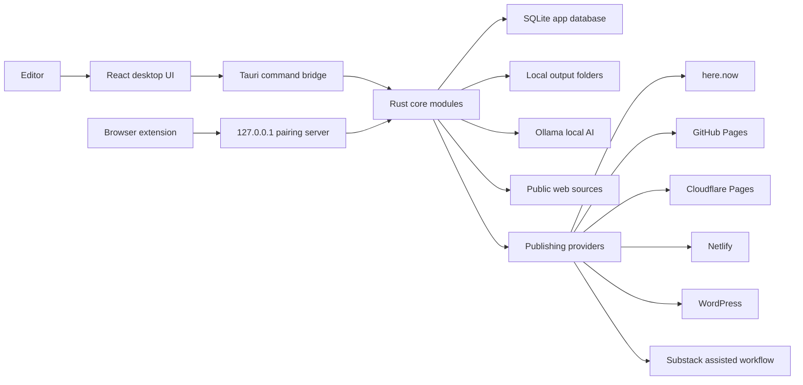
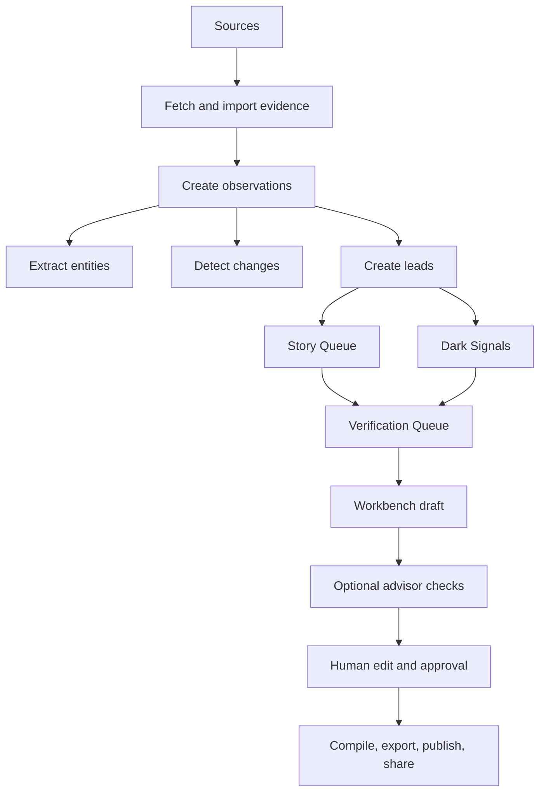

# CivicNewspaper Architecture

CivicNewspaper is the repository name. The installed desktop app is The Civic Desk.

The product is a local-first newsroom desktop app for small local publishers. It watches civic sources, imports source lists, finds leads, stores evidence, helps an editor draft and verify stories, and exports or publishes a static local paper.

The system is advisory about editorial judgment. It can rank, warn, summarize, and suggest verification work. It must not make the editor's news judgment for them, but deterministic package-integrity checks can block static approval/export until broken evidence, empty copy, reporter-note scaffolding, or unsupported citations are fixed.

## System Overview

## Major Components

### Desktop Shell

- Tauri wraps the app as a native desktop program.
- React and TypeScript provide the user interface.
- Rust owns source fetching, import parsing, database writes, local AI calls, publishing, backup, and extension pairing.
- SQLite stores the newsroom state on the local machine.

### Local AI

The app uses Ollama for local model calls when available. The AI path supports:

- Daily Scan summarization and ranking.
- Draft assistance.
- Press-freedom and legal-risk advisor output.
- Source and lead explanation.

The app must degrade when Ollama is missing, slow, offline, or when a model is not installed. Deterministic fetch, import, review, publish, and backup flows should remain usable without AI.

### Source Intake

Source intake has three main paths:

- Manual source entry.
- Bulk import from CSV, TXT, XLSX, DOCX, and text-readable PDFs.
- Discovery adapters for official sites, feeds, agenda portals, document pages, local media, public social/community sources, and search fallback.

Image-only scanned PDFs require OCR support before URLs can be extracted. A normal text PDF can be parsed without OCR.

### Browser Extension

The browser extension is a local helper for sending pages into The Civic Desk while the editor reads.

- Pairing happens through a short-lived code.
- The loopback service binds to `127.0.0.1:12053`.
- Browser requests are protected with Host/Origin checks and bearer authorization after pairing.
- Pairing is local to the computer. It is not an internet service.

## Newsroom Flow

## Civic Intelligence Layer

The civic intelligence layer converts raw evidence into structured newsroom observations.

Observation types include:

- `source_fetched`
- `document_changed`
- `agenda_item_found`
- `video_posted`
- `entity_detected`
- `social_signal_found`

Entity types include:

- people
- companies
- parcels
- addresses
- vendors
- agencies

The app stores observations and entities so the editor can trace why a lead exists, what changed, and which source produced it.

## Dark Signal Desk

The Dark Signal Desk is for weak, early, unusual, or socially surfaced signals that might become stories.

It should:

- Rank signals.
- Explain why a signal may matter.
- Show origin, risk, entities, suggested verification path, and publication status.
- Preserve signals for editor review.
- Keep low-confidence Tier C material out of published evidence by default.

It must not hide information from the editor. Ranking is not censorship. The editor decides what to pursue.

## Verification Queue

The verification queue turns leads and signals into action items.

Task states:

- `suggested`
- `auto_checked`
- `needs_human`
- `blocked`
- `resolved`

Tasks can link back to stories, signals, sources, entities, and evidence.

## Workbench And Editorial Guardrails

The Workbench is where writers and editors draft, revise, hold, approve, or return stories for more work.

Guardrails and the press-freedom/legal-risk advisor are advisory only. They can warn about sourcing, attribution, defamation risk, privacy risk, public/private figure questions, and verification gaps. They do not make the editor's decision. Separately, deterministic static-package checks can visibly block approval/export until the public package is valid.

Publisher identity, organization type, tone, copyright/footer text, and public site language are configurable so the app does not invent the publisher's business model or editorial policy.

## Publishing

Publishing is built around static output first.

Default publishing order:

1. here.now for simple temporary civic website publishing.
2. GitHub Pages for a durable public archive.
3. Netlify or WordPress for credentialed technical users.
4. Manual Cloudflare Pages hosting by exporting the folder or ZIP and recording the public URL.
5. Substack/newsletter as distribution, not the canonical archive.

The app can produce:

- Static HTML issue output.
- Article pages.
- Homepage.
- RSS feed.
- About, ethics, corrections, and reporting pages.
- ZIP archive.
- Newsletter markdown.
- Substack-ready markdown.
- Social/community share copy.

## Publisher Connector Layer

The Rust publisher layer uses provider-neutral concepts:

- Validate provider configuration.
- Publish a folder or ZIP.
- Return a `PublishResult`.
- Store publish metadata.
- Keep provider credentials in secure settings where supported.

Supported provider families in the current code:

- `here_now`
- `github_pages`
- `netlify`
- `cloudflare_pages` assisted/manual beta workflow
- `substack`
- `wordpress`

Substack is currently an assisted workflow: generate the post body, open the editor, copy title/deck/body, and allow the user to store the final Substack URL after posting.

## Data Storage

SQLite is the application database. Schema changes are applied by migration files in `src-tauri/migrations/`; there is no `0002` migration. Applied schema version is tracked with `PRAGMA user_version`.

Current migration files:

- `0001_init.sql`
- `0003_settings.sql`
- `0004_source_tier.sql`
- `0005_daily_scans.sql`
- `0006_daily_scan_lead_source_nullable.sql`
- `0007_source_tier_check.sql`
- `0008_draft_publish_gate.sql`
- `0009_daily_scan_lead_context.sql`
- `0010_publish_runs.sql`
- `0011_subscribers.sql`
- `0012_civic_intelligence.sql`
- `0013_verification_queue.sql`
- `0014_beat_memory.sql`
- `0015_story_quality_metadata.sql`
- `0016_recurrence_metadata.sql`
- `0017_publish_decision_audit.sql`

Current primary tables:

- `sources`
- `evidence_items`
- `leads`
- `lead_evidence`
- `drafts`
- `published_posts`
- `paired_clients`
- `settings`
- `daily_scan_runs`
- `daily_scan_leads`
- `publish_runs`
- `subscribers`
- `civic_observations`
- `civic_entities`
- `civic_observation_entities`
- `source_performance_scores`
- `dark_signals`
- `verification_tasks`
- `verification_task_links`
- `beat_memory`
- `story_templates`
- `publish_decision_audits`

The Stage 3 story-quality layer depends on these newer supporting tables:

- `beat_memory` tracks recurring topics so the app can warn when a lead is background or seen-before material instead of treating every familiar page as fresh news.
- `story_templates` stores format guidance for briefs, watch items, investigations, and other story types so the local model has newsroom-specific structure without hard-coding every instruction in source.
- `publish_decision_audits` records the editor-facing reason and gate context around publish decisions. This preserves human judgment and review history without giving software veto power.

## Security Model

Security boundaries are local-first, not offline-only.

- Drafts, database files, settings, and outputs live on the user's machine by default.
- External network calls happen when the user fetches sources, discovers sources, uses publishing connectors, or opens public pages.
- Credentials for publishing providers should be stored through secure settings/keyring paths where available.
- The browser extension communicates only with the loopback pairing server.
- The app uses a content security policy for the desktop webview and should keep it as tight as practical for the current frontend.

## Deployment Model

The release build creates desktop installers from the Tauri app.

Current public beta installers are unsigned. A stable release needs signed Windows installers, macOS signing/notarization, cross-platform clean-machine installer proof, and repeatable release smoke artifacts.

## Current Stable-Release Gaps

The app has public-beta functionality, but stable release still needs:

- Signed installers.
- More clean-machine coverage across platforms.
- More live provider verification with real user-owned credentials.
- OCR path for scanned PDFs.
- More durability testing for interruption during scan, import, publish, model setup, and backup.
- More independent UX testing on non-technical users.
