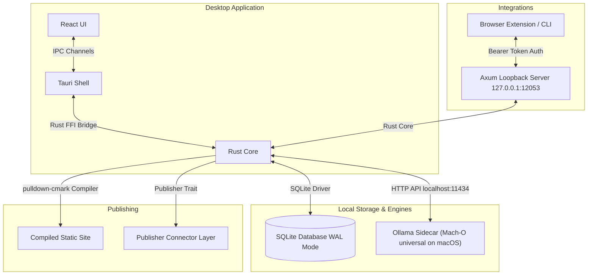
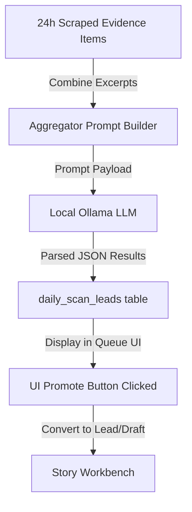
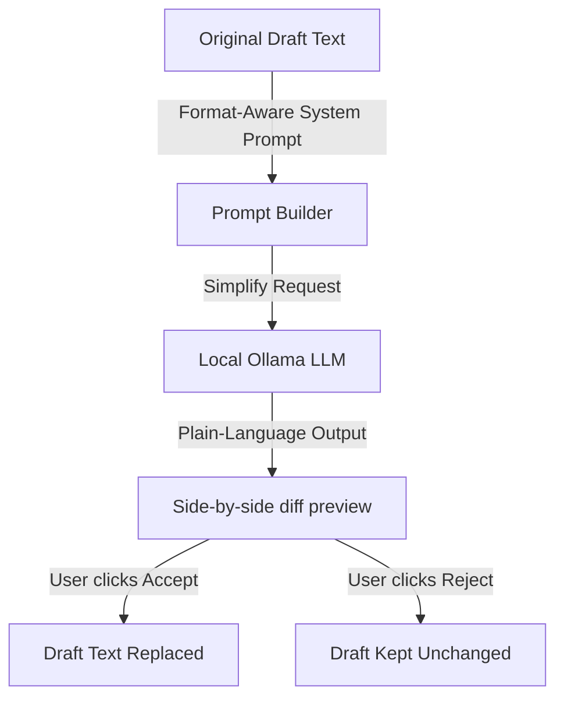
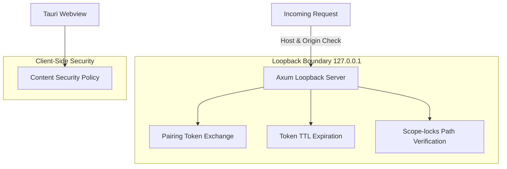
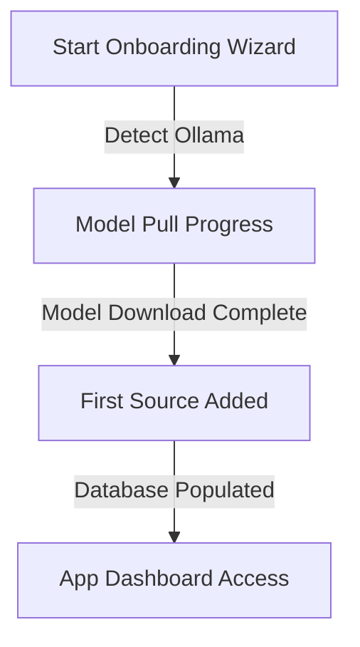

# CivicNewspaper System Architecture

This document describes the architectural design, data models, and security boundaries of CivicNewspaper.

---

## 🏗️ System Overview

CivicNewspaper is a local-first desktop application. It operates entirely on the user's local machine, leveraging Tauri for the OS interface, React for the UI, and a Rust core for data orchestration.

### Components
1. **Tauri Desktop Shell**: Native desktop host wrapper compiled with Rust. Manages window lifecycles, native file dialogs, and subprocess security.
2. **React UI**: Responsive user interface built with React 19, TypeScript, and modern CSS.
3. **Rust Core**: Hand-written core modules implementing feed scraping, database persistence, regex matching, markdown compilation, and local server routing.
4. **Ollama Sidecar**: Bundled service running locally on port `11434` providing offline LLM completion APIs. The app spawns and reaps the sidecar itself, and coexists with an externally running `ollama serve` rather than starting a duplicate. On Linux the sidecar runs CPU-only (GPU acceleration is a known, deferred limitation).
5. **SQLite Database**: Single-file relational storage with Write-Ahead Logging (WAL) enabled for performance and crash resilience. The data layer follows a single-writer design, which is appropriate for a single-user local desktop app: WAL lets readers proceed concurrently while one writer holds the write lock at a time, with no multi-process write contention to coordinate. (A Rust agent may add a matching code comment.)
6. **Compiled Static Site**: Output folder containing parsed HTML files, style assets, and an RSS feed.

---

## 🔄 Data Flow

The core workflow of CivicNewspaper translates municipal records into structured news feeds.

```mermaid
graph LR
    Sources[Sources] -->|URLs/Feeds| Scraper[Scraper]
    Scraper -->|Excerpts / Raw Text| Detectors[Regex Detectors]
    Detectors -->|Matches & Checklist| Leads[Leads]
    Leads -->|Promote / AI Draft| Drafts[Drafts]
    Drafts -->|pulldown-cmark Compiler| CompiledSite[Compiled Site]
    CompiledSite -->|Output| RSS[RSS Feed]
```

1. **Sources**: RSS feeds, HTML portals, or browser clips.
2. **Scraper**: Pulls raw HTML or XML content, extracts clean text, and stores them as `evidence_items`.
3. **Detectors**: Scans stored text chunks against the eight detectors in `detectors.rs` (e.g. monetary thresholds, key votes, personnel updates).
4. **Leads**: Structured signals that group matched evidence paragraphs.
5. **Drafts**: Factual markdown articles written on the Workbench tab.
6. **Compiled Site & RSS**: Finished static HTML documents and an RSS feed exported to the output directory.

> **Note on guardrails:** the journalistic-integrity guardrails (`guardrails.rs`) warn by default, but an editor can mark words as *blocking* (Settings → Story guardrails). A blocking issue, and a missing human attestation, are **enforced** at publish time: `story_decision` rejects publish-advancing transitions, and `compile_static_site` re-checks each draft (requiring attestation, and clean-or-overridden) as defense-in-depth, so it can skip a draft that reached a publishable status by another path.

---

## ⚡ Daily Scan Flow

The Daily Scan uses the local language model to aggregate multiple sources of information over a 24-hour window and identify potential leads.

* **Evidence Items**: Scraped documents and text chunks collected in the last 24 hours.
* **Aggregator Prompt**: Groups all excerpts into a single compact context window, requesting the LLM to identify key developments.
* **Local LLM**: Generates structured JSON summaries of findings.
* **daily_scan_leads**: Database representation of scan findings (see the schema below). Each run is recorded in `daily_scan_runs`; promoted leads link back via the `leads.from_scan_lead_id` column.
* **UI Promote**: Operator reviews scan results and clicks "Promote" to establish an editable story draft.

---

## ✍️ Plain-Language Rewrite Flow

Operators can simplify complex legalese and municipal jargon into plain English using the offline rewrite flow.

* **Format-Aware System Prompt**: Instructs the LLM to write for a general public audience, preserving numbers and names while discarding jargon.
* **Diff preview**: The rewrite is held in preview state and shown side-by-side against the original; the draft is updated only when the editor explicitly **Accepts**, and discarded on **Reject**.

---

## 🔒 Security Model

To protect the local computer from malicious web scripts, CivicNewspaper enforces rigid security boundaries.

* **Loopback Server**: The Axum server strictly binds to the loopback IP `127.0.0.1:12053`. Any external interface request is rejected.
* **Host & Origin Headers**: `auth.rs` accepts a request only when the `Host` header is exactly `127.0.0.1:12053`, and (when an `Origin` header is present) only when the origin is a `chrome-extension://` origin. This blocks DNS-rebinding and cross-origin attacks from malicious browser tabs.
* **Pairing token (not a 6-digit PIN)**: To pair an extension, the app generates a **one-time 22-character URL-safe base64 pairing token** — 16 random bytes from `OsRng` — and stores only its **SHA-256 hash** (in `paired_clients.pairing_pin`) with a 5-minute TTL. The client submits the plaintext token to `/api/pair`; the server hashes and compares it, and on success issues a long-lived bearer **API token**. The 22-character/~128-bit secret is what makes brute-forcing the pairing window infeasible (see `SECURITY.md`). *There is no separate 6-digit PIN — that mechanism does not exist; the legacy `pairing_pin` column name notwithstanding.*
* **Bearer auth**: After pairing, every loopback request must include `Authorization: Bearer <API token>`.
* **Scope-locks**: File system directories are verified prior to writing backups or compiled sites, preventing directory traversal attacks.
* **Content Security Policy**: The webview CSP blocks loading third-party scripts or frames.

---

## 🚀 Onboarding Flow

The startup wizard ensures all dependencies are set up before allowing the operator to use the application workspace.

* **Detect Ollama**: Checks if the Ollama background daemon is reachable on `127.0.0.1:11434`.
* **Model Pull Progress**: Triggers the recommended model pull and tracks the download progress bytes.
* **First Source**: Requests the user's initial feed to populate the workspace database.

---

## 🗃️ Database Schema

The SQLite schema is **not** a single static file — it is built additively by a migration runner from the SQL files in `src-tauri/migrations/`. The current set is `0001_init.sql`, `0003_settings.sql`, `0004_source_tier.sql`, `0005_daily_scans.sql`, `0006_daily_scan_lead_source_nullable.sql`, `0007_source_tier_check.sql`, `0008_draft_publish_gate.sql`, `0009_daily_scan_lead_context.sql`, and `0010_publish_runs.sql` (there is no `0002`). The runner tracks applied migrations via `PRAGMA user_version` and applies each unapplied file in a transaction.

The live schema is **eleven tables**: the seven defined in `0001_init.sql` below, plus `settings` (0003), `daily_scan_runs` / `daily_scan_leads` (0005), and `publish_runs` (0010). Migrations also added the `sources.tier` column (0004/0007), the `leads.from_scan_lead_id` column (0005), Daily Scan lead context columns (0009), and the `drafts.attested_by` / `attested_at` / `guardrail_override_reason` columns (0008, for the publish gate).

### `sources`
Stores details of the public municipal feeds to monitor.
* `id`: `INTEGER PRIMARY KEY AUTOINCREMENT`
* `name`: `TEXT NOT NULL`
* `url`: `TEXT NOT NULL UNIQUE`
* `type`: `TEXT NOT NULL` (e.g., `primary_record`, `official_comm`, `community_signal`, `media_lead`)
* `status`: `TEXT NOT NULL DEFAULT 'online'`
* `last_success_at`, `last_failed_at`, `last_scraped`: `TEXT` (RFC3339 timestamps)
* `tier`: `TEXT NOT NULL DEFAULT 'community_signal'` *(added 0004; constrained in 0007 to `official_record` | `news_reporting` | `community_signal`)*

### `evidence_items`
Raw data chunks extracted from municipal documents.
* `id`: `INTEGER PRIMARY KEY AUTOINCREMENT`
* `source_id`: `INTEGER REFERENCES sources(id) ON DELETE CASCADE`
* `url`: `TEXT` (source file URL link)
* `fetched_at`: `TEXT NOT NULL`
* `excerpt`: `TEXT NOT NULL` (the raw text chunk)
* `content_hash`: `TEXT NOT NULL UNIQUE` (SHA-256 hash of the excerpt to prevent duplicates)
* `entities`: `TEXT NOT NULL DEFAULT '[]'` (JSON array of parsed OSINT entities)

### `leads`
Flags raised by automated detector matching.
* `id`: `INTEGER PRIMARY KEY AUTOINCREMENT`
* `detector_name`: `TEXT NOT NULL` (e.g., `Money Threshold`, `Watchlist Hit`)
* `why`: `TEXT NOT NULL` (human-readable explanation)
* `confidence`: `TEXT NOT NULL` (e.g., `low`, `medium`, `high`)
* `risk_level`: `TEXT NOT NULL DEFAULT 'low'`
* `confirmation_checklist`: `TEXT NOT NULL DEFAULT '[]'` (JSON array of verifications)
* `from_scan_lead_id`: `INTEGER` *(added 0005; links a promoted Daily Scan finding back to its `daily_scan_leads` row)*
* `created_at`: `TEXT NOT NULL`

### `lead_evidence`
Many-to-many relationship mapping evidence items to leads.
* `lead_id`: `INTEGER REFERENCES leads(id) ON DELETE CASCADE`
* `evidence_id`: `INTEGER REFERENCES evidence_items(id) ON DELETE CASCADE`
* `PRIMARY KEY (lead_id, evidence_id)`

### `drafts`
Article documents in various states of verification.
* `id`: `INTEGER PRIMARY KEY AUTOINCREMENT`
* `lead_id`: `INTEGER REFERENCES leads(id) ON DELETE SET NULL`
* `format`: `TEXT NOT NULL` (e.g., `brief`, `watch`, `explainer`, `investigation`, `opinion`)
* `title`: `TEXT NOT NULL`
* `content`: `TEXT NOT NULL` (Markdown body)
* `status`: `TEXT NOT NULL DEFAULT 'lead'` (statuses include `lead`, `draft_generated`, `ready_to_review`, `ready_to_publish`, `hold`, `killed`, `corrected`)
* `verification_checklist`: `TEXT NOT NULL DEFAULT '[]'`
* `missing_evidence_notes`, `correction_note`: `TEXT`
* `created_at`, `updated_at`: `TEXT NOT NULL`

### `published_posts`
Records of compiled publications.
* `id`: `INTEGER PRIMARY KEY AUTOINCREMENT`
* `draft_id`: `INTEGER REFERENCES drafts(id) ON DELETE CASCADE`
* `file_path`: `TEXT NOT NULL`
* `url`: `TEXT NOT NULL`
* `published_at`: `TEXT NOT NULL`
* `correction_history`: `TEXT NOT NULL DEFAULT '[]'`

### `publish_runs` *(added in `0010_publish_runs.sql`)*
Issue-level records for generated static-site export and publish packages.
* `id`: `INTEGER PRIMARY KEY AUTOINCREMENT`
* `issue_id`: `TEXT NOT NULL`
* `output_path`: `TEXT NOT NULL`
* `generated_files`: `TEXT NOT NULL DEFAULT '[]'` (JSON array of generated file paths)
* `provider`, `published_url`, `deployment_id`: `TEXT` (connector metadata; blank for local export-only runs)
* `article_count`, `skipped_count`, `files_written`: `INTEGER NOT NULL DEFAULT 0`
* `generated_at`: `TEXT NOT NULL`

## Publisher Connector Layer

The publisher layer lives in `src-tauri/src/core/publisher.rs`. It defines a provider-neutral `Publisher` trait with:

* `validate_config` for non-secret connector metadata.
* `test_connection` for dry-run/readiness checks.
* `publish_folder` for the provider-neutral publish call that receives the compiled output folder/ZIP and returns provider URL/deployment metadata.

The first shipped connectors are guided/manual connectors for GitHub Pages, Netlify, Cloudflare Pages, Substack, WordPress, and other static hosts. They validate local publish artifacts and public URLs, then route through the same manifest/share-package/update path used by the Publishing screen. This intentionally avoids pretending to perform token-based API uploads before a provider-specific API implementation is wired and tested.

Connector metadata is stored in the existing `settings` table under `publisher.config.<provider>`. Secrets are not stored in SQLite; provider credentials are written to the operating system credential store through the Rust `keyring` crate. The frontend only receives `has_credential`, never the credential value.

### `paired_clients`
Authorized external integrations.
* `id`: `INTEGER PRIMARY KEY AUTOINCREMENT`
* `token`: `TEXT NOT NULL UNIQUE` (the long-lived bearer API token, stored hashed)
* `label`: `TEXT NOT NULL`
* `pairing_pin`: `TEXT` *(despite the name, this stores the SHA-256 hash of the 22-char pairing token, not a numeric PIN)*
* `pin_expires_at`: `TEXT` (5-minute TTL for the pairing token)
* `created_at`: `TEXT NOT NULL`
* `last_used_at`: `TEXT`
* `revoked`: `INTEGER NOT NULL DEFAULT 0` (0=false, 1=true)

### `settings` *(added in `0003_settings.sql`)*
Key/value application settings.
* `key`: `TEXT PRIMARY KEY`
* `value`: `TEXT NOT NULL` (e.g. the row `model.selected` holds the active Ollama model)

### `daily_scan_runs` *(added in `0005_daily_scans.sql`)*
One row per Daily Scan execution.
* `id`: `INTEGER PRIMARY KEY AUTOINCREMENT`
* `started_at`: `TEXT NOT NULL`
* `completed_at`: `TEXT`
* `run_status`: `TEXT NOT NULL`

### `daily_scan_leads` *(added in `0005`, rebuilt in `0006`)*
Findings produced by a Daily Scan run.
* `id`: `INTEGER PRIMARY KEY AUTOINCREMENT`
* `scan_id`: `INTEGER NOT NULL REFERENCES daily_scan_runs(id)`
* `title`: `TEXT NOT NULL`
* `summary`: `TEXT NOT NULL`
* `source_id`: `INTEGER REFERENCES sources(id)` *(made nullable in 0006)*
* `original_url`: `TEXT NOT NULL`
