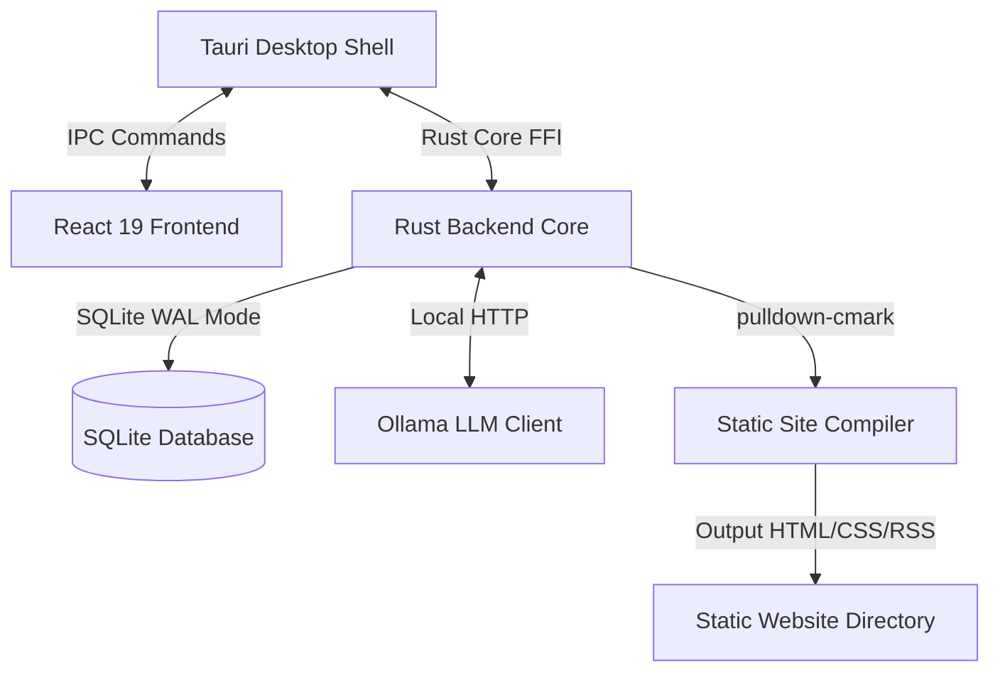

# CivicNewspaper User Manual

Welcome to the **CivicNewspaper User Manual**. This document is split into three parts:
- **Part 1 — For Newsroom Operators (Non-Technical)**: Installation, onboarding, daily operations, drafting, and publishing.
- **Part 2 — For Technical Operators**: Architecture details, security model, regex detectors, linting guardrails, and system management.
- **Part 3 — For Developers**: Setup for local development, code layout, writing tests, and contributing.

---

# Part 1 — For Newsroom Operators

This section is written in plain English for journalists, editors, and community publishers. You do not need any coding experience to follow these steps.

## 1. Installation
CivicNewspaper runs entirely on your local computer to keep your notes, articles, and data completely private. To install the app:

* **Windows**:
  1. Download the latest `.exe` or `.msi` installer from the [GitHub Release Page](https://github.com/scottconverse/CivicNewspaper/releases/latest).
  2. Double-click the installer.
  3. Because the installer is not digitally signed, Windows SmartScreen will show a blue warning popup: *"Windows protected your PC"*.
  4. Click **"More info"** on the warning popup, then click the **"Run anyway"** button that appears.

* **macOS**:
  1. Download the latest `.dmg` file from the [GitHub Release Page](https://github.com/scottconverse/CivicNewspaper/releases/latest).
  2. Double-click the `.dmg` and drag **CivicNewspaper** into your **Applications** folder.
  3. Right-click (or Control-click) the **CivicNewspaper** icon in your Applications folder and select **Open**.
  4. A Gatekeeper warning will appear saying macOS cannot verify the developer. Click **Open** anyway.
  5. If the app is blocked, open your Mac's **System Settings > Privacy & Security**, scroll down to the Security section, and click **"Open Anyway"** for CivicNewspaper.

* **Linux**:
  1. Download the `.deb` package (Ubuntu/Debian). Linux builds are deb-only.
  2. Install it using your system package manager:
     ```bash
     sudo dpkg -i civicnewspaper_*.deb
     ```
  3. **Note:** On Linux, the bundled Ollama engine runs on the CPU only. GPU acceleration is not bundled on Linux yet (tracked as a known limitation); inference still works, just slower.

## 2. First-Time Setup
On your very first launch, the **Onboarding Wizard** will walk you through five essential setup steps:

1. **Identity**:
   * Enter your community profile details including **Publication Name** (e.g. *Oak Valley Council Watch*), **Editor Name**, **City**, and **State**.
2. **AI Service Setup**:
   * The application checks the connection status of the bundled offline Ollama sidecar AI engine. You do not need to install Ollama separately.
3. **Download AI Model**:
   * Pull the recommended offline AI model based on your system RAM (e.g. `gemma2:9b` for RAM >= 12GB, `llama3:8b` for RAM >= 8GB, or `phi3:mini` for lower specs).
4. **Defaults**:
   * Configure your publication paths: **Publish Path** (where static HTML sites are compiled) and **Backup Path** (where database backups are stored).
5. **Done**:
   * Finish the setup to initialize your database and enter the main workspace.

## 3. Adding Your First Source
To watch your local government, you must tell the app which web pages or feeds to monitor.
1. Click the **Sources** tab in the sidebar.
2. Click **Add Source** (or use the **Auto-Discovery Wizard** to scan a site for hidden RSS feeds).
3. Enter the details:
   * **Source Name**: e.g., *City Council Agendas*
   * **Source URL**: The webpage or RSS feed link (e.g., `https://cityhall.gov/minutes.xml`).
   * **Source Type**:
     * *Primary Record*: Official government minutes, resolutions, and budgets.
     * *Official Communication*: Press releases, public notice portals.
     * *Media Lead*: Other news sites or blogs (scrapes headlines only to respect copyright).
   * Each source is also assigned a reliability **tier** (`official_record`, `news_reporting`, or `community_signal`), derived from the source type, which the app uses to prioritise review.
4. Click **Save**.

## 4. The Daily Scan
The **Daily Scan** is your command center for catching important events.
* Every day, CivicNewspaper aggregates all new scraped text, minutes, and documents collected over the previous 24 hours.
* Click the **Daily Scan** button at the top of the queue.
* The local AI reads the combined raw text and compiles a high-level summary of important civic signals (meetings, contracts, hires).
* The scan produces **Daily Scan Leads**. You can review these leads in your inbox and click **Promote to Story** to send a lead directly to your editing workbench.

## 5. Generating Your First Draft
Once a lead is promoted, open the **Workbench** tab:
1. **Choose a Story Format**: Select whether you want to write a short *Brief*, a deeper *Watch*, or an in-depth *Investigation*.
2. **Click Generate Draft**: The local AI reads the specific raw government minutes attached to the lead and writes a factual draft article.
3. **Citations (Evidence)**: The AI automatically embeds links like `[Record](evidence:12)`. Do not remove these! When published, readers can hover or click these links to see the exact paragraph or sentence from the official city hall record.
4. **Guardrail Warnings**: In the workbench sidebar, CivicNewspaper checks your text and shows advisory warnings. These guardrails are a *lint-like helper* — they flag issues for you to fix, but they do **not** block you from saving, approving, or publishing a draft. They will warn you if:
   * A paragraph makes a factual claim but has no citation to official evidence (*Citation Coverage*).
   * You used accusatory words (like *stole*, *corrupt*, *fraud*) without a supporting citation (*Accusatory Language*).
   * You mentioned an arrest or charge without a presumption-of-innocence modifier (like *alleged* or *allegedly*) (*Legal Naming*).
   * A paragraph copies a long verbatim run of words directly from a linked source (*Verbatim Overlap* — see Part 2 §4).

## 6. Plain-Language Rewrite
Government documents and legal letters are often filled with dense jargon. You can translate this into readable community news using the **Plain-Language Rewrite** feature:
1. Select the draft or highlight the section of text you want to simplify in the editor.
2. Click the **Plain-Language Rewrite** button.
3. The app will prompt the local AI with a format-aware system instruction designed to strip out jargon and legalese while retaining all numbers and key facts.
4. The rewrite is shown for your review before anything changes. You explicitly **Accept** (apply it) or **Reject** (discard it) — the original draft is never overwritten without your confirmation.

## 7. Publishing Your News
When you are ready to share your stories with the community:
1. In the workbench, click **Approve for Static Publish** on your drafts.
2. Go to the **Publish** panel in the sidebar.
3. Select an **Output Directory** on your computer (e.g., a folder on your Desktop named `CivicNewsSite`).
4. Click **Compile Static Site**.
5. CivicNewspaper will take all approved drafts, convert them to clean HTML, apply your templates, generate an RSS feed (`feed.xml`), and write them to the selected folder along with the about / ethics / how-we-report / corrections pages.
6. The app will open a browser window displaying the folder. Simply drag-and-drop this folder into a free web host like **Netlify Drop** or upload it to your **GitHub Pages** account to make it live for the public.

---

# Part 2 — For Technical Operators

This section covers the technical architecture, security design, and system behaviors for system administrators or technically inclined operators.

## 1. System Architecture
CivicNewspaper is structured as a local-first desktop application with five core modules:



* **Tauri Desktop Shell**: Native desktop host wrapper compiled with Rust. Manages window lifecycles, native file dialogs, and subprocess security.
* **React 19 Frontend**: Responsive user interface built with TypeScript and modular React components.
* **Rust Backend Core**: The engine of the application. Handles SQLite database operations, HTTP requests to the Ollama API, feed parsing, and site building.
* **Ollama (Sidecar/Service)**: Bundled service running locally on port `11434` providing offline LLM completion APIs. CivicNewspaper spawns the sidecar itself; if a developer is already running `ollama serve` on that port, the app coexists with it instead of starting a duplicate.
* **SQLite Database**: Single-file relational storage with Write-Ahead Logging (WAL) enabled for performance and crash resilience.

## 2. Security Model
CivicNewspaper operates under a strict zero-trust local-only security boundary:

* **Loopback Axum Server**: To allow integration with browser extensions (for clipping records) and IDE/CLI plugins, the Rust core exposes an HTTP server. This server is strictly bound to the loopback interface (`127.0.0.1:12053`). It rejects any incoming requests originating from external network interfaces.
* **Host & Origin Headers Verification**: The Axum server validates incoming HTTP headers. Requests whose `Host` header is not exactly `127.0.0.1:12053`, or whose `Origin` (when present) is not a `chrome-extension://` origin, are rejected — this prevents DNS-rebinding attacks. (See `src-tauri/src/core/auth.rs`.)
* **Pairing token protocol**: When pairing a new browser extension or CLI tool:
  1. The user clicks "Pair Device" in the Tauri UI. The app generates a **one-time pairing token** — 16 random bytes from the OS cryptographic RNG (`OsRng`), encoded as a 22-character URL-safe base64 string — and stores **only its SHA-256 hash** in SQLite with a 5-minute expiry (TTL). The plaintext token is shown to you once.
  2. You paste that 22-character token into the external client, which submits it to the `/api/pair` endpoint on the loopback server.
  3. The server hashes the submitted token, matches it against the stored hash, and (if valid and unexpired) issues a long-lived bearer **API token** for that client.

  > There is **no separate "6-digit PIN."** The single shared secret is the 22-character base64 pairing token. (Older drafts of this manual described a 6-digit PIN; that mechanism does not exist in the code.)
* **Token Storage and TTL**: The pairing token's SHA-256 hash is what lives in SQLite (the `paired_clients.pairing_pin` column stores the hash, despite the legacy column name). After pairing, every request to the loopback server must carry the long-lived token in the `Authorization: Bearer <TOKEN>` header.
* **Scope-locks**: File system access (e.g., database backups, static site compilation outputs) is restricted using scope verification. Paths must resolve within user-approved target directories.
* **Content Security Policy (CSP)**: The Tauri webview enforces a rigid CSP that blocks external script execution, preventing Cross-Site Scripting (XSS) even if malicious HTML is scraped from a municipal site.

## 3. Automated Detectors
The application runs incoming scraped text through a synchronous loop of **eight detectors** defined in [detectors.rs](../src-tauri/src/core/detectors.rs). The detector names below are the exact `detector_name` strings the engine writes to the `leads` table:

1. **Source Went Quiet** *(source-level)*: Fires when a source has not *successfully* fetched for **7 or more days** relative to its last scrape attempt. The threshold is a fixed 7 days (it is not user-configurable). Signals a possible URL change or a stopped feed.
2. **New Primary Record**: Fires when a new document is fetched from a source whose type is `primary_record` or `official_comm`, prompting you to read the new official record.
3. **Money Threshold**: Matches dollar amounts written as `$`-prefixed digit groups — the regex is `\$([0-9,]+)(?:\.[0-9]+)?`, e.g. `$100,000` or `$250,000.50`. A lead fires only when the matched amount is **at or above** your configured money threshold (default `$250,000`). **Note:** spelled-out amounts like "1.2 million dollars" and abbreviated forms like "$250K" are **not** matched — the detector reads literal `$NNN,NNN` numbers only.
4. **Decision / Vote**: Matches official-action keywords: `unanimously`, `voted`, `approved`, `resolved`, `passed`, `carried`, `denied`, `motion`, `adopted`, `rejected`.
5. **Personnel Change**: Matches staff-transition keywords: `appoint`, `resign`, `retire`, `terminate`, `hire`, `employ`, `vacancy`, `successor`, `resignation`, `appointment`, `fired`, `promoted`.
6. **Public Meeting Scheduled**: Matches meeting-notice phrases: `public hearing`, `special meeting`, `session will be held`, `meeting scheduled`, `council chamber`, `town hall`, `public meeting`. **Note:** it does not match clock times (e.g. `7:30 PM`) or the phrase "will convene."
7. **Deadline**: Matches deadline / procurement language: `deadline`, `submit by`, `due date`, `public comment period`, `rfp`, `bid due`, `applications close`. (RFP/bid terms live inside this single detector; there is no separate "Bids & RFPs" detector.)
8. **Watchlist Hit**: Matches any keyword from your user-defined watchlist (developer names, companies, parcel numbers, etc.) as a whole-word, case-insensitive match.

> There is **no** "Ordinances & Resolutions" detector. Any document mentioning a vote on an ordinance would surface through the **Decision / Vote** detector.

## 4. Linting Guardrails
To support journalistic integrity, the Workbench runs four advisory checks in [guardrails.rs](../src-tauri/src/core/guardrails.rs). **These are advisory only.** They surface in the Workbench UI and via the `/api/guardrails/check` route; the static-site compiler never runs them. Nothing here blocks saving, status changes, or publication — a draft in `ready_to_publish`/`published`/`corrected` compiles regardless of guardrail state.

* **Citation Coverage** *(warning)*: Each substantive paragraph (longer than ~30 characters) that contains no `evidence:` / `evidence://` link is flagged as a factual claim missing its citation.
* **Accusatory Language** *(error)*: If a paragraph contains a high-risk term (`corrupt`, `stole`, `illegal`, `fraud`, `embezzle`, `bribe`, `scam`, `theft`, `criminal`, `guilty`, `conspiracy`, `extortion`, `misconduct`, `kickback`, `laundering`, `arrested`, `charged`, `indicted`, `convicted`, `prosecuted`) **and** has no citation, it is flagged.
* **Legal Naming / Presumption of Innocence** *(error)*: If a paragraph uses charge/legal terms (`arrested`, `charged`, `indicted`, `accused`, `suspect`, `theft`, `embezzle`, `fraud`, `misconduct`) but contains neither `alleged` nor `allegedly`, it is flagged so you can add the modifier.
* **Verbatim Overlap** *(warning)*: For drafts tied to a lead, every paragraph is compared against the linked evidence excerpts; any run of **7+ consecutive words** copied verbatim from a source is flagged with the evidence ID and source URL, prompting you to rewrite it in your own words or set it as a blockquote.

A report is considered "clean" only when no **error**-severity issue is present; warnings do not affect cleanliness and never block anything.

## 5. Database Migrations
Database schema updates are handled automatically by a migration runner on application launch:
* Migrations are stored as plain SQL files in `src-tauri/migrations/` (`0001`, `0003`–`0007`; there is no `0002`).
* On startup, the runner compares the database's `PRAGMA user_version` against the available migrations and applies any unapplied ones.
* Migrations run inside a transaction; on failure the transaction rolls back and the app halts with an error rather than running on a half-migrated schema. (See Part 3 §3 for the live table list.)

## 6. Diagnostic Export
If an operator experiences issues, they can export a diagnostic package via the Settings panel. The export is **manual** — you choose where the file is saved, and you decide whether to share it.

The report (the `Diagnostics` struct in [diagnostics.rs](../src-tauri/src/core/diagnostics.rs)) contains exactly the following, and nothing else:
* App version, OS name, OS version, and Tauri version.
* Ollama reachability and the list of installed model names.
* The database schema version (`PRAGMA user_version`).
* Four **row counts only** — number of evidence items, leads, drafts, and published posts. (Counts, never the contents.)
* The last 100 lines of the application log (`panic_log_tail`).

> **What it does *not* contain.** The export never collects your community-profile fields, story-draft text, feed URLs, or pairing/API tokens — so there is no "redaction" step, because none of that data is gathered in the first place. (An earlier version of this manual claimed the exporter "automatically redacts" drafts, profile names, feed URLs, and tokens; that described a feature that does not exist.) The one field that is free text is the 100-line log tail — review it before sharing in case an error message happens to quote content.

---

# Part 3 — For Developers

This section provides details on how to build, test, and contribute to the CivicNewspaper codebase.

## 1. Developer Environment & Prerequisites
To build and run CivicNewspaper from source, ensure you have:
* **Node.js 18+** & `npm`
* **Rust compiler (Stable)** via `rustup`
* **Ollama**: For developers building from source only, you may install Ollama locally to test custom or external configurations.
* **Platform Dependencies**:
  * *Windows*: C++ Build Tools (via Visual Studio Installer).
  * *macOS*: Xcode Command Line Tools.
  * *Linux*: `libwebkit2gtk-4.1-dev`, `build-essential`, `libxdo-dev`, `libssl-dev`, `libayatana-appindicator3-dev`, `librsvg2-dev`.

## 2. Quickstart Development Commands
1. Clone the repository and install frontend dependencies:
   ```bash
   git clone https://github.com/scottconverse/CivicNewspaper.git
   cd CivicNewspaper
   npm install
   ```
2. Start the development server (runs Vite with hot-reloading for the frontend, and compiles/runs Tauri in debug mode):
   ```bash
   npm run tauri dev
   ```
3. To package the application for production (creates installer files for your current OS in `src-tauri/target/release/bundle/`):
   ```bash
   npm run tauri build
   ```

## 3. Database Management & Inspecting State
The SQLite database file is located in the standard application data directory:
* **Windows**: `%APPDATA%\org.civicnews.app\civicnews.db`
* **macOS**: `~/Library/Application Support/org.civicnews.app/civicnews.db`
* **Linux**: `~/.local/share/org.civicnews.app/civicnews.db`

You can open this database using any SQLite client (e.g., `sqlite3`, DB Browser for SQLite, or a VS Code extension). The live schema (across migrations `0001`–`0007`) contains these tables:

* `sources` — monitored feeds (includes a `tier` column added in `0004`/`0007`).
* `evidence_items` — raw scraped text chunks. *(This is the table that holds scraped content — there is no `scraped_items` table.)*
* `leads` — detector hits (includes a `from_scan_lead_id` column added in `0005`).
* `lead_evidence` — many-to-many map of leads to evidence.
* `drafts` — article documents and their status.
* `published_posts` — compiled-publication records.
* `paired_clients` — authorized external integrations.
* `settings` — key/value app settings (added in `0003`; e.g. `model.selected`).
* `daily_scan_runs` — Daily Scan run records (added in `0005`).
* `daily_scan_leads` — Daily Scan findings (added in `0005`, rebuilt in `0006`).

> There is **no `migrations` table.** Schema version is tracked via SQLite's built-in `PRAGMA user_version`, not a tracking table.

## 4. LLM Mocking & Testing
For testing and development without calling a real Ollama instance:
* The application utilizes the `LlmClient` trait to decouple the core logic from direct network calls to Ollama.
* You can write mock implementations of the `LlmClient` trait for unit testing without spinning up any Ollama service.
* Core business logic (e.g. `run_daily_scan`, `plain_language_rewrite`) takes an injected `Arc<dyn LlmClient>` so tests can pass a fake client directly, without constructing Tauri application state. See the tests in [tests.rs](../src-tauri/src/core/tests.rs).
* To run the Rust tests:
   ```bash
   cd src-tauri
   cargo test
   ```
* To run the frontend Vitest unit/component tests:
   ```bash
   npm run test
   ```

## 5. Contributing and Code Layout
* Frontend UI state is managed in [src/useApp.ts](../src/useApp.ts) which interacts with the Rust backend via Tauri IPC (`invoke`).
* When implementing a new LLM-backed feature, use the `LlmClient` trait defined in [llm.rs](../src-tauri/src/core/llm.rs). This ensures your code is testable using mock clients.
* If you modify the database schema, add a new versioned `.sql` file to [src-tauri/migrations/](../src-tauri/migrations/) following the numbered-prefix convention. The detector definitions in [detectors.rs](../src-tauri/src/core/detectors.rs) and the guardrail checks in [guardrails.rs](../src-tauri/src/core/guardrails.rs) are the single source of truth for Part 2 §3 and §4 — keep those sections in sync if you change the engine.
