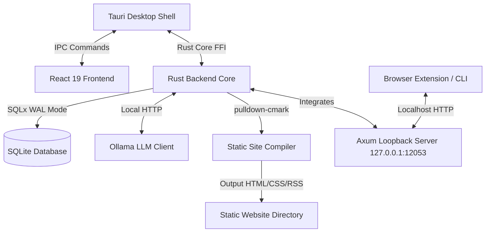

# CivicNewspaper User Manual

Welcome to the **CivicNewspaper User Manual**. This document is split into three parts:
- **Part 1 — For Newsroom Operators (Non-Technical)**: Installation, onboarding, daily operations, drafting, and publishing.
- **Part 2 — For Technical Operators**: Architecture details, security model, regex detectors, linting guardrails, and system management.
- **Part 3 — For Developers**: Setup for local development, code layout, writing tests, and contributing.

---

# Part 1 — For Newsroom Operators

This section is written in plain English for journalists, editors, and community publishers. You do not need any coding experience to follow these steps.

## 1. Installation
CivicNewspaper runs entirely on your local computer to keep your notes, articles, and data completely private. To install the app:

* **Windows**:
  1. Download the latest `.exe` or `.msi` installer from the [GitHub Release Page](https://github.com/scottconverse/CivicNewspaper/releases/latest).
  2. Double-click the installer.
  3. Because the installer is not digitally signed, Windows SmartScreen will show a blue warning popup: *"Windows protected your PC"*.
  4. Click **"More info"** on the warning popup, then click the **"Run anyway"** button that appears.
  
* **macOS**:
  1. Download the latest `.dmg` file from the [GitHub Release Page](https://github.com/scottconverse/CivicNewspaper/releases/latest).
  2. Double-click the `.dmg` and drag **CivicNewspaper** into your **Applications** folder.
  3. Right-click (or Control-click) the **CivicNewspaper** icon in your Applications folder and select **Open**. 
  4. A Gatekeeper warning will appear saying macOS cannot verify the developer. Click **Open** anyway.
  5. If the app is blocked, open your Mac's **System Settings > Privacy & Security**, scroll down to the Security section, and click **"Open Anyway"** for CivicNewspaper.

* **Linux**:
  1. Download the `.deb` package (Ubuntu/Debian) or the `.AppImage`.
  2. For the `.deb` package, install it using your system package manager:
     ```bash
     sudo dpkg -i civicnewspaper_*.deb
     ```
  3. For the `.AppImage`, right-click the file, go to **Properties > Permissions**, check **"Allow executing file as program"** (or run `chmod +x CivicNewspaper.AppImage`), and double-click to launch.

## 2. First-Time Setup
On your very first launch, the **Onboarding Wizard** will walk you through three essential setup steps:

1. **Ollama & Model Setup**: 
   * CivicNewspaper uses **Ollama** to run a local artificial intelligence model on your computer. This means no cloud subscriptions and complete privacy.
   * If you do not have Ollama installed, the wizard will prompt you to download it from [ollama.com](https://ollama.com). Keep Ollama running in the background.
   * The wizard will initiate a download of the default writing model, **Gemma 2 (9B)**. This model file is approximately **5.4 GB**. Depending on your internet speed, the download may take anywhere from 10 minutes to an hour. 
   * *Tip:* If your computer has less than 16 GB of RAM, you can select a smaller model (such as Llama 3 8B or Gemma 2 2B) in the setup to keep your computer running smoothly.
2. **Community Profile**:
   * Fill in your website's **Title** (e.g., *Oak Valley Council Watch*), **Subtitle**, and a short **About** page bio explaining your mission.
   * Write an **Ethics Statement** (e.g., *"We compile primary records. Every claim is linked directly to an official document. No opinion, no rumors."*).
3. **Local Database Initialization**:
   * The app will create a local SQLite database file in a secure app directory on your computer to store your configuration, feeds, signals, and drafts.

## 3. Adding Your First Source
To watch your local government, you must tell the app which web pages or feeds to monitor.
1. Click the **Sources** tab in the sidebar.
2. Click **Add Source** (or use the **Auto-Discovery Wizard** to scan a site for hidden RSS feeds).
3. Enter the details:
   * **Source Name**: e.g., *City Council Agendas*
   * **Source URL**: The webpage or RSS feed link (e.g., `https://cityhall.gov/minutes.xml`).
   * **Source Type**: 
     * *Primary Record*: Official government minutes, resolutions, and budgets.
     * *Official Communication*: Press releases, public notice portals.
     * *Media Lead*: Other news sites or blogs (scrapes headlines only to respect copyright).
4. Click **Save**.

## 4. The Daily Scan
The **Daily Scan** is your command center for catching important events.
* Every day, CivicNewspaper aggregates all new scraped text, minutes, and documents collected over the previous 24 hours.
* Click the **Daily Scan** button at the top of the queue.
* The local AI reads the combined raw text and compiles a high-level summary of important civic signals (meetings, contracts, hires).
* The scan produces **Daily Scan Leads**. You can review these leads in your inbox and click **Promote to Story** to send a lead directly to your editing workbench.

## 5. Generating Your First Draft
Once a lead is promoted, open the **Workbench** tab:
1. **Choose a Story Format**: Select whether you want to write a short *Brief*, a deeper *Watch*, or an in-depth *Investigation*.
2. **Click Generate Draft**: The local AI reads the specific raw government minutes attached to the lead and writes a factual draft article.
3. **Citations (Evidence)**: The AI automatically embeds links like `[Record](evidence:12)`. Do not remove these! When published, readers can hover or click these links to see the exact paragraph or sentence from the official city hall record.
4. **Guardrail Warnings**: In the workbench sidebar, CivicNewspaper will check your text for errors. It will warn you if:
   * A paragraph lacks a citation to official evidence.
   * You used accusatory words (like *stole*, *corrupt*) without a direct citation.
   * You mentioned an arrest without including presumption-of-innocence modifiers (like *alleged* or *charged*).

## 6. Plain-Language Rewrite
Government documents and legal letters are often filled with dense jargon. You can translate this into readable community news using the **Plain-Language Rewrite** feature:
1. Select the draft or highlight the section of text you want to simplify in the editor.
2. Click the **Plain-Language Rewrite** button.
3. The app will prompt the local AI with a format-aware system instruction designed to strip out jargon and legalese while retaining all numbers and key facts.
4. A popup window (`window.confirm`) will display a side-by-side comparison of the original text and the new, simple version.
5. Review the changes. If they are accurate, click **Confirm** to replace the jargon-filled text with the plain-language version.

## 7. Publishing Your News
When you are ready to share your stories with the community:
1. In the workbench, click **Approve for Static Publish** on your drafts.
2. Go to the **Publish** panel in the sidebar.
3. Select an **Output Directory** on your computer (e.g., a folder on your Desktop named `CivicNewsSite`).
4. Click **Compile Static Site**.
5. CivicNewspaper will take all approved drafts, convert them to clean HTML, apply your templates, generate an RSS feed (`feed.xml`), and write them to the selected folder.
6. The app will open a browser window displaying the folder. Simply drag-and-drop this folder into a free web host like **Netlify Drop** or upload it to your **GitHub Pages** account to make it live for the public.

---

# Part 2 — For Technical Operators

This section covers the technical architecture, security design, and system behaviors for system administrators or technically inclined operators.

## 1. System Architecture
CivicNewspaper is structured as a local-first desktop application with five core modules:



* **Tauri Desktop Shell**: Native desktop host wrapper compiled with Rust. Manages window lifecycles, native file dialogs, and subprocess security.
* **React 19 Frontend**: Responsive user interface built with TypeScript and modular React components.
* **Rust Backend Core**: The engine of the application. Handles SQLite database operations, HTTP requests to the Ollama API, feed parsing, and site building.
* **Ollama (Sidecar/Service)**: Independent service running locally on port `11434` providing offline LLM completion APIs.
* **SQLite Database**: Single-file relational storage with Write-Ahead Logging (WAL) enabled for performance and crash resilience.
* **Compiled Static Site**: Output folder containing parsed HTML files, style assets, and RSS feeds.

## 2. Security Model
CivicNewspaper operates under a strict zero-trust local-only security boundary:

* **Loopback Axum Server**: To allow integration with browser extensions (for clipping records) and IDE/CLI plugins, the Rust core exposes an HTTP server. This server is strictly bound to the loopback interface (`127.0.0.1:12053`). It rejects any incoming requests originating from external network interfaces.
* **Host & Origin Headers Verification**: The Axum server validates incoming HTTP headers. Any request with an `Origin` or `Host` header not matching `localhost` or `127.0.0.1` is dropped immediately to prevent DNS rebinding attacks. (CLI tools pair without Origin header validations).
* **Pairing PIN Protocol**: When pairing a new browser extension or CLI tool:
  1. The user clicks "Pair Device" in the Tauri UI, which generates a random 6-digit PIN and registers it in SQLite with a short 5-minute expiration (TTL).
  2. The external client sends the PIN to the pairing endpoint on the loopback server.
  3. Upon verification, the server issues a long-lived cryptographically secure API Token (22-character base64 URL-safe token).
* **Token Storage and TTL**: API tokens are hashed before being stored in SQLite. Requests to the loopback server must include the token in the `Authorization: Bearer <TOKEN>` header.
* **Scope-locks**: File system access is restricted using scope verification. Paths must resolve within user-approved target directories.
* **Content Security Policy (CSP)**: The Tauri webview enforces a rigid CSP that blocks external script execution, preventing Cross-Site Scripting (XSS) even if malicious HTML is scraped from a municipal site.

## 3. Automated Detectors
The application runs incoming scraped text through a synchronous loop of **eight regex detectors** defined in `detectors.rs`:

1. **Large Money Amounts**: Flags occurrences of currency formatting above the user's defined financial threshold.
2. **Votes & Decisions**: Matches terms indicating official government actions (e.g., `voted to`, `unanimously approved`, `motion carried`, `denied`, `rejected`).
3. **Personnel Changes**: Identifies new hires, resignations, or firings (e.g., `appointed`, `resigned`, `terminated`, `hired as`).
4. **Meetings & Hearings**: Matches dates, times, and scheduling keywords (e.g., `public hearing`, `special session`, `at 7:30 PM`, `will convene on`).
5. **Watchlist Matches**: Checks text against user-defined keywords.
6. **Quiet Source Check**: Triggers a notification lead if a source feed has not updated within a configured number of days (default: 14 days).
7. **Bids & RFPs**: Flags public procurement terms (e.g., `Request for Proposal`, `RFP`, `sealed bids`, `lowest responsible bidder`).
8. **Ordinances & Resolutions**: Detects legislative updates (e.g., `ordinance no.`, `resolution adopting`, `amending chapter`).

## 4. Linting Guardrails
To enforce journalistic integrity, the workbench runs checking algorithms in `guardrails.rs` before compile:

* **Missing Evidence Citations**: Every paragraph in a draft is scanned. If a paragraph makes claims but contains no valid markdown links matching the `evidence:ID` protocol, a warning is raised.
* **Accusatory Language Lint**: Scans for high-risk words (e.g., `fraud`, `theft`, `bribe`, `corrupt`). If found, the guardrail checks if a citation immediately follows the sentence containing the word.
* **Presumption of Innocence**: Searches for arrest or crime-related keywords (`arrested`, `indicted`, `charged`). It verifies that a modifier expressing presumption of innocence (e.g., `alleged`, `allegedly`) exists within a 5-word window.

## 5. Database Migrations
Database schema updates are handled automatically by a migration runner on application launch:
* Migrations are stored as plain SQL files in `src-tauri/migrations/`.
* On startup, the Rust backend checks the `schema_migrations` table.
* Any unapplied migrations are executed inside a single transaction. If a migration fails, the transaction rolls back, and the app halts.

## 6. Diagnostic Export
If an operator experiences issues, they can export a diagnostic package via the Settings panel:
* Generates a detailed JSON payload containing OS metadata, database row counts, active configuration flags, and the last 100 log lines.
* **Privacy Filtering**: The exporter automatically redacts the user's community profile names, story drafts, specific URL domains in feeds, and API pairing tokens.

---

# Part 3 — For Developers

This section provides details on how to build, test, and contribute to the CivicNewspaper codebase.

## 1. Developer Environment & Prerequisites
To build and run CivicNewspaper from source, ensure you have:
* **Node.js 18+** & `npm`
* **Rust compiler (Stable)** via `rustup`
* **Ollama** installed locally
* **Platform Dependencies**:
  * *Windows*: C++ Build Tools (via Visual Studio Installer).
  * *macOS*: Xcode Command Line Tools.
  * *Linux*: `libwebkit2gtk-4.1-dev`, `build-essential`, `libxdo-dev`, `libssl-dev`, `libayatana-appindicator3-dev`, `librsvg2-dev`.

## 2. Quickstart Development Commands
1. Clone the repository and install frontend dependencies:
   ```bash
   git clone https://github.com/scottconverse/CivicNewspaper.git
   cd CivicNewspaper
   npm install
   ```
2. Start the development server (runs Vite with hot-reloading for the frontend, and compiles/runs Tauri in debug mode):
   ```bash
   npm run tauri dev
   ```
3. To package the application for production (creates installer files for your current OS in `src-tauri/target/release/bundle/`):
   ```bash
   npm run tauri build
   ```

## 3. Database Management & Inspecting State
The SQLite database file is located in the standard application data directory:
* **Windows**: `%APPDATA%\org.civicnews.app\civicnews.db`
* **macOS**: `~/Library/Application Support/org.civicnews.app/civicnews.db`
* **Linux**: `~/.local/share/org.civicnews.app/civicnews.db`

You can open this database using any SQLite client to inspect the tables (`sources`, `scraped_items`, `leads`, `drafts`, `migrations`).

## 4. LLM Mocking & Testing
For testing and development without calling a real Ollama instance:
* The test suite mock-starts an HTTP server that mimics Ollama's response payload structure.
* To run the Rust tests:
   ```bash
   cd src-tauri
   cargo test
   ```
* To run the frontend Vitest unit/component tests:
   ```bash
   npm run test
   ```

## 5. Contributing and Code Layout
* Frontend UI state is managed in `src/useApp.ts` which interacts with the Rust backend via Tauri IPC (`invoke`).
* When implementing a new LLM-backed feature, use the `LlmClient` trait defined in `llm.rs`.
* If you modify the database schema, make sure to add a new versioned `.sql` file to `src-tauri/migrations/` following the naming prefix convention.
